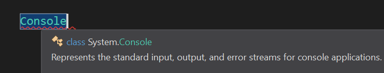
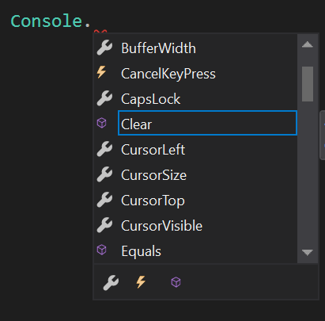

@title[C# 01]

# C# #
## Grunnur 01

---

C# forrit byrja í Main fallinu í Program.cs skránni

+++?gist=diddimar/b07e9b4997507b3b0f7d65346ea4578b&file=program.cs&lang=cs&title=C# Program
@[1](Using statements)
@[3](Our namespace)
@[5-11](The Program)
@[7-10](Entry point)

---
@title[Console]

 Console klassinn gefur okkur aðferðir* til að skrifa í console gluggan ásamt því að taka við innslætti notenda o.fl.

+++

Með því að skrifa Console og svo '.' er hægt að sjá hvað  er í boði

---?gist=diddimar/b07e9b4997507b3b0f7d65346ea4578b&file=write.cs&lang=cs&title=Console Write
@[8](Skrifar textastreng í glugga)

+++?gist=diddimar/b07e9b4997507b3b0f7d65346ea4578b&file=read.cs&lang=cs&title=Console Read

+++?gist=diddimar/b07e9b4997507b3b0f7d65346ea4578b&file=csharp.cs&lang=cs&title=Too fast
@[9](Skrifar textastreng en lokast strax)

+++?gist=diddimar/b07e9b4997507b3b0f7d65346ea4578b&file=helloworld.cs&lang=cs&title=Hello World
@[9](Skrifar textastreng í console glugga)
@[10](Hlustar eftir línu inslátt (ENTER))

---?gist=diddimar/b07e9b4997507b3b0f7d65346ea4578b&file=final.cs&lang=cs&title=First Program